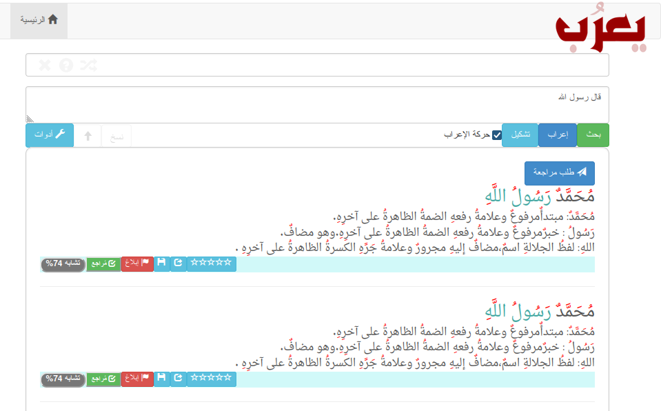
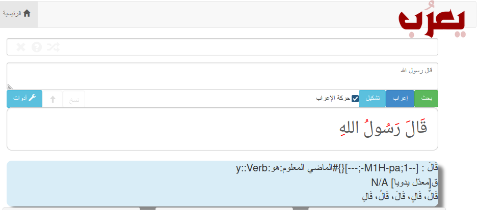

# Yarob يعرُب

Ya'rob I'rab Arabic Inflection   يَعرًب: برنامج للإعراب


<div dir='rtl'>

## الوصف

- منصة الإعراب: يعرب

  منصة لغوية لمشاركة إعراب الجمل العربية


برنامج "يعرُب"  منصة للإعراب اللغوي للجمل العربية. يُوفر موارد وخدمات لمساعدتك في فهم الجمل العربية وإعراب كلماتها وأجزائها.  يقدّم البرنامَج خدمة الإعراب الآلي المساعد، حيث يساعدك  في تحليل الجمل وتحديد وظيفة كل كلمة في الجملة، للوصول إلى الإعراب الصحيح.

يوفر المساعد: خدمة التشكيل والتحليل الصرفي، كما يتيح البحث في الجمل المُعربة المحفوظة. وقاعدة بيانات إعراب الكلمات والأدوات النحوية.

يحتوي البرنامج أيضًا على أزرار لخدمات إضافية، مثل التشكيل الآلي للكلمات، والبحث في الجمل المعربة المحفوظة، وتعديل الإعراب إن رغبت في ذلك.


تتضمن المنصة خدمة البحث في الجمل المعربة المحفوظة، حيث يمكنك البحث عن جمل مشابهة لجملتك أو جزء منها. على سبيل المثال، إذا بحثت عن جملة "أكل الولد تفاحة"، فسيوفر لك البرنامج جملًا أخرى تحتوي على الكلمات نفسها مثل "أكل الغلام تفاحة" أو "تفاحة جميلة" أو "أكل لذيذ".

تتيح المنصة أيضًا إمكانية إعراب الكلمات المُفردة، تبحث عن كلمة ما، في  قاعدة البيانات، وتنفع هذه في المساعدة على إعراب الحروف والأدوات النحوية  مثل "إذا"، "إذن"، وإعرابها بسرعة وسهولة.

تحتوي المنصة أيضًا على مساعد للإعراب يمكنك الاستفادة منه، حيث يمكنك  تحديد نوع الكلمة (فعل أو اسم) أو تشكيلها للحصول على توضيحات إضافية.  يمكنك أي

وفي حالة الحاجة إلى مساعدة إضافية، يمكنك طلب خدمة الإعراب من خبير بشري عبر البرنامج. سيكون لديك الفرصة للتواصل مع خبير لغوي حقيقي للحصول على إعراب مدقّق.   كما يتوفر أزرار خاصة لكل نتيجة إعراب، مثل إمكانية إرسال النتيجة للمراجعة من قبل خبير بشري، وتقييم النتيجة، ونسخ النتيجة، ومشاركتها، وعرض نسبة التشابه مع جمل محفوظة.

توفر المنصة أيضًا خاصية التبليغ عن أي مشكلة، مثل جملة غير لائقة أو إعراب خاطئ أو إساءة استخدام. يمكنك الإبلاغ عن هذه الأمور وسيعالج علاجًا  مناسبًا.

من بين السياسات التي يتبعها البرنامج، يُمنع إدخال نصوص غير عربية، ويمنع الألفاظ الخارجة من الظهور في النتائج. تتضمن المنصة سياسة نشر محددة للمستخدم، إذا كان رغب في نشر طلباته ونتائجه آليًا أم لا،  كما يتوفر أيضًا خدمة الحظر المؤقت لمدة أيام بطلب من المستخدم، ويمكن للمعلمين استخدام هذه الخاصية لمنع ظهور نتيجة الإعراب قبل انتهاء الامتحانات.

[Yarob](https://tahadz.com/yarob)  is a platform for linguistic parsing of Arabic sentences إعراب. It provides resources and services to help you understand Arabic sentences and parse their words and parts. 
 
 The program provides an automated parsing assistant service, which helps you analyze sentences and determine the function of each word in the sentence, to reach the correct parsing.

The assistant provides: the morphological analysis service, and allows searching in saved parsed sentences. And a database of parsing words and grammatical tools.

The program also contains buttons for additional services, such as automatic word diacritization, searching in saved parsed sentences, and modifying parsing if you wish
</div>

## أصل التسمية

اسم علم مذكر عربي قحطاني منقول عن الفعل، وهو الذي يتكلم العربية بفصاحة. ويعرب بن قحطان أبو العرب.

</div>


#### Developpers: 

 Taha Zerrouki: http://tahadz.com
    taha dot zerrouki at gmail dot com

| Features       | value                                                        |
| -------------- | ------------------------------------------------------------ |
| Authors        | [Authors.md](https://github.com/linuxscout/yarob/master/AUTHORS.md) |
| Release        | 0.1                                                          |
| License        | [GPL](https://github.com/linuxscout/yarob/master/LICENSE)    |
| Tracker        | [linuxscout/yarob/Issues](https://github.com/linuxscout/yarob/issues) |
| Accounts       | [@Twitter](https://twitter.com/linuxscout)                   |
| <!-- Website   | [https://pypi.python.org/pypi/yarob](https://pypi.python.org/pypi/yarob)--> |
| <!--Doc        | [package Documentaion](http://pythonhosted.org/yarob/)       |
| Source         | [Github](http://github.com/linuxscout/yarob)-->              |
| <!--Download   | [sourceforge](http://yarob.sourceforge.net)-->               |
| <!-- Feedbacks | [Comments](http://tahadz.com/yarob/contact) -->              |


## Citation

If you would cite it in academic work, can you use this citation

```
T. Zerrouki‏, Yarob, Arabic mophological Inflection Analysis Library for python.,  https://pypi.python.org/pypi/yarob/, 2019
```

or in bibtex format

```bibtex
@misc{zerrouki2019yarob,
  title={yarob, Arabic mophological Inflection Analysis Library python.},
  author={Zerrouki, Taha},
  url={https://pypi.python.org/pypi/yarob},
  year={2023}
}
```

## Applications

* تعلم إعراب الجمل
* المساعدة في بناء الدروس
* تعلم العربية

## Features  مزايا

<div dir='rtl'>

- التشكيل الآلي من مشكال النصوص

- الإعراب الآلي المساعد

- خدمة البحث في الجمل المُعربة المحفوظة

  - البحث عن جمل مشابهة
  - مثلا إذا بحث عن "أكل الولد تفاحة" تحصل على جمل فيها الكلمات (أكل، الولد، تفاحة) مثل 
    - أكل الغلام تفاحة
    - تفاحة جميلة
    - أكل لذيذ

- طلب خدمة الإعراب من خبير بشري

- إعراب الكلمات

- مشاركة الجمل المعربة

- التبليغ عن

  - جملة غير لائقة
  - إعراب خطأ
  - إعراب له أوجه أخرى
  - إساءة الاستخدام

- يمنع إدخال النصوص غير العربية

- منع الألفاظ الخارجة من الظهور

- أزرار خاصة بكل نتيجة إعراب

  - راجعه خبير بشري/ لم يراجعه خبير
  - تقييم
  - نسخ النتيجة
  - مشاركة النتيجة
  - نسبة التشابه

- أزرار خدمات

  - تشكيل آلي
  - بحث في الجمل المحفوظة
  - تعديل الإعراب

- سياسة النشر

  - هل يسمح بنشر الجمل المطلوبة آليا؟
  - منع الجمل التي فيها ألفاظ خارجة
  - عدم نشر جملة ما حسب طلب المستخدم
  - خدمة الحظر المؤقت لمدة أيام بطلب من المستخدم، يمكن استعمالها من قبل المعلمين

- مساعد الإعراب

  - خيار إزالة الالتباس بتقييد نوع الكلمة فعل/اسم أو تشكيلها
  - طلب مراجعة بشرية
  - إرسال بالبريد الالكتروني

  </div>

## Installation

### Requirements

``` 
pip install -r requirements.txt 
```

<div dir='rtl'>

## Usage

حاليا يتوفر البرنامج في صورة تطبيق وب فقط

```
make server
```

Run a server on http://127.0.0.1:5000 


## Example 

* صفحة تجريبية للبحث في الجمل المُعربة المحفوظة

  

* صفحة تجريبية لمساعد الإعراب

  

